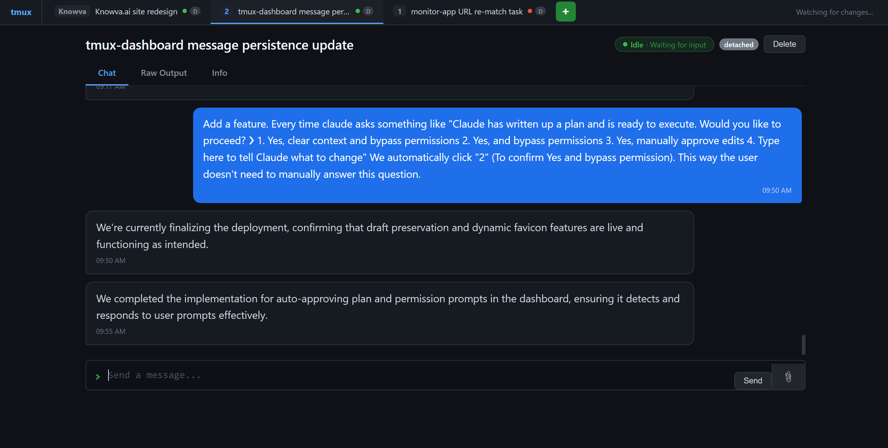
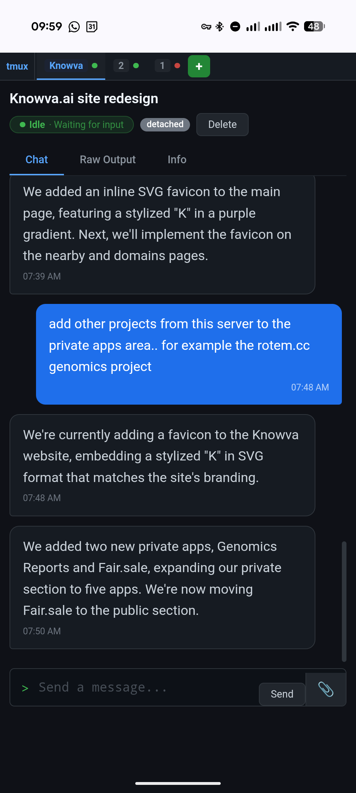

# Claude tmux Manager

A real-time web dashboard for monitoring and interacting with tmux sessions running Claude Code. See what each session is doing at a glance, manage Claude authentication, track token usage, send commands, upload files, and get AI-generated summaries of activity.


## Screenshots

| Desktop | Mobile |
|---------|--------|
|  |  |

## Features

- **Live session monitoring** — See all tmux sessions with busy/idle status indicators that update every 10 seconds
- **Claude Code auth management** — Top-right indicator shows connection status (green = OAuth, purple = API key, red = disconnected). Click to open a dropdown with auth details, API key configuration, and logout
- **Token usage tracking** — Today's token usage breakdown (input, output, cache read, cache write) with a visual bar, shown in the auth dropdown. Parsed from Claude Code session files in real time
- **AI-powered summaries** — Three-tier LLM summaries using GPT-4o-mini:
  - **Project** — What this session is working on
  - **Progress** — What's been accomplished so far
  - **Realtime** — What's happening right now, with context-aware responses to user chat messages
- **Chat interface** — Send commands to terminals through a chat-style UI; messages appear as a back-and-forth conversation with AI-generated status replies
- **Persistent chat history** — All messages (user commands and AI responses) are saved to disk and survive page reloads and server restarts
- **File upload** — Upload files directly to the working directory of any tmux session via the paperclip button
- **Session management** — Create and delete tmux sessions from the browser, with an optional auto-launch command (e.g. `claude --dangerously-skip-permissions`)
- **Auto-approve prompts** — Automatically detects Claude Code plan/permission prompts and selects "Yes, and bypass permissions" so sessions don't block waiting for input
- **Advanced activity detection** — Multi-signal busy/idle detection that handles Claude Code's complex UI:
  - Spinner icons with any verb (`Stewing…`, `Brewing…`, etc.) via generic pattern matching
  - Running task indicators (`◼`) with line-anchored matching to avoid false positives from conversation text
  - Live time/token counters (`↑`/`↓` streaming indicators)
  - `esc to interrupt` status bar detection
  - Shell prompt recognition (`$`, `>`, `❯`)
  - Completion messages (`Cogitated for Xs`, `Brewed for Xs`, etc.)
- **API key injection** — Stored Anthropic API keys are automatically injected into new tmux sessions via `ANTHROPIC_API_KEY` environment variable
- **Dynamic favicon** — Browser tab icon changes color in real time (green = idle, red = busy) so you can monitor status without switching tabs
- **Draft preservation** — Text typed in the input box is preserved when switching between sessions or tabs
- **Password protected** — Cookie-based login page with configurable credentials (or no auth for local use)
- **Mobile friendly** — Responsive design that works on phones and tablets with a tappable auth indicator
- **Single file** — The entire app is one Python file with embedded HTML/CSS/JS — no build step, no frontend toolchain, no database

## Quick Start

### Prerequisites

- Python 3.9+
- tmux
- Claude Code CLI (`claude`) — for auth management and token tracking
- An OpenAI API key — for LLM summaries

### Install

```bash
git clone https://github.com/NimoRotem/Claude_tmux_manager.git
cd Claude_tmux_manager

pip install -r requirements.txt

cp env.example .env
# Edit .env with your OpenAI API key and desired credentials
```

### Run

```bash
# Load environment variables and start
export $(grep -v '^#' .env | xargs)
python3 app.py
```

The dashboard will be available at `http://localhost:8501/tmux/`.

### Run with systemd / supervisor (production)

Copy and edit the included supervisor config:

```bash
sudo cp supervisor.conf /etc/supervisor/conf.d/tmux-dashboard.conf
sudo nano /etc/supervisor/conf.d/tmux-dashboard.conf
# Update: paths, user, and environment variables (API key, credentials)

sudo supervisorctl reread
sudo supervisorctl update
```

### Reverse proxy (nginx)

Add this to your nginx site config:

```nginx
location /tmux/ {
    proxy_pass http://127.0.0.1:8501/;
    proxy_set_header Host $host;
    proxy_set_header X-Real-IP $remote_addr;
    proxy_set_header X-Forwarded-For $proxy_add_x_forwarded_for;
    proxy_set_header X-Forwarded-Proto $scheme;
}
```

To serve at a different path, also set `TMUX_DASH_ROOT_PATH` to match:

```bash
TMUX_DASH_ROOT_PATH=/my-dashboard
```

## Configuration

All configuration is via environment variables:

| Variable | Default | Description |
|----------|---------|-------------|
| `OPENAI_API_KEY` | (required) | OpenAI API key for LLM summaries |
| `TMUX_DASH_USER` | `admin` | Login username |
| `TMUX_DASH_PASS` | (empty) | Login password (empty = no auth) |
| `TMUX_DASH_SECRET` | (auto) | Cookie signing secret. Auto-generated if not set, but login sessions will invalidate on server restart |
| `TMUX_DASH_PORT` | `8501` | Server port |
| `TMUX_DASH_ROOT_PATH` | `/tmux` | URL base path (must match your reverse proxy config) |
| `TMUX_DASH_NEW_SESSION_CMD` | (empty) | Command to auto-run in new sessions (e.g. `claude --dangerously-skip-permissions`) |

## How It Works

### Claude Code Auth Management

The dashboard can manage Claude Code authentication from the web UI:

- **OAuth status** — Checks `claude auth status --json` to detect existing OAuth sessions
- **API key storage** — Store an Anthropic API key via the dropdown panel. The key is persisted to `~/.tmux-dashboard/anthropic_api_key` with `0600` permissions
- **Auto-injection** — When a new tmux session is created, any stored API key is automatically exported as `ANTHROPIC_API_KEY` before the session command launches
- **Logout** — Sign out of Claude Code OAuth and/or clear stored API keys from the UI

### Token Usage Tracking

The dashboard parses Claude Code session JSONL files (`~/.claude/projects/`) to compute today's token usage:

- **Input tokens** — Direct input to the model
- **Output tokens** — Generated response tokens
- **Cache write tokens** — Tokens written to prompt cache
- **Cache read tokens** — Tokens served from prompt cache

Usage is computed per UTC day from message timestamps and cached server-side for 60 seconds. The visual breakdown bar in the auth dropdown shows the relative proportion of each token category.

### Activity Detection

The dashboard reads the bottom 25 lines of each tmux pane every 10 seconds to determine session state. Detection uses line-anchored pattern matching to avoid false positives from conversation text:

- **Busy** — Detected via:
  - Spinner icons (`✶`, `✽`, `✻`, `·`, `●`) followed by a verb ending in `…`
  - Running task indicators (`◼`) at the start of a line
  - Live time/token counters with `↑`/`↓` streaming direction
  - The `esc to interrupt` status bar
  - `(thinking)` indicator on spinner lines
- **Idle** — Detected via shell prompts (`$`, `>`, `❯`), Claude Code completion messages (`Cogitated for Xs`, `Brewed for Xs`), or tip text — but only after confirming no busy signals exist in the wider window
- **Unknown** — When neither busy nor idle patterns match

### Auto-Approve

During each status poll, the dashboard scans for Claude Code's interactive prompts (plan approval, permission requests). When detected, it automatically navigates to option 2 ("Yes, and bypass permissions") and presses Enter, with a 10-second cooldown to prevent duplicate sends.

### LLM Summaries

Three independent summary tiers are cached with different TTLs:

- **Project description** — Generated once per session, never auto-expires
- **Progress** — Regenerated every 10 minutes
- **Realtime** — Regenerated every 60 seconds and on status changes (busy→idle)

The realtime summary feeds into the chat as assistant messages. When a user has recently sent a chat message, the LLM receives it as context to produce a relevant response instead of a generic terminal summary. A similarity-based dedup (>70% word overlap) prevents near-identical messages from piling up.

### Chat Messages

User commands sent through the chat input are:
1. Sent to the tmux session via `tmux send-keys`
2. Stored in the chat history as user messages
3. Persisted to `~/.tmux-dashboard/messages.json`

AI responses are appended when the realtime summary updates (typically after a busy→idle transition).

### File Upload

Files uploaded via the paperclip button are saved to the current working directory of the selected tmux session (detected via `tmux display-message #{pane_current_path}`). Each upload is logged as a chat message.

## Architecture

```
Browser  ──→  nginx (/tmux/)  ──→  FastAPI (uvicorn :8501)  ──→  tmux
                                        │
                                        ├── OpenAI API (summaries)
                                        ├── Claude Code CLI (auth status)
                                        ├── tmux CLI (capture-pane, send-keys)
                                        ├── ~/.claude/projects/ (token usage)
                                        └── ~/.tmux-dashboard/
                                             ├── messages.json
                                             └── anthropic_api_key
```

Single-file architecture: `app.py` contains the FastAPI backend, all HTML/CSS/JS (embedded as a template string), and the LLM integration. No build step, no frontend toolchain, no database.

## API Endpoints

| Method | Endpoint | Description |
|--------|----------|-------------|
| `GET` | `/` | Dashboard UI |
| `POST` | `/login` | Authenticate (form POST) |
| `GET` | `/api/sessions` | List all sessions with summaries |
| `GET` | `/api/status` | Lightweight status poll (no LLM calls) |
| `POST` | `/api/sessions/{name}/refresh` | Regenerate realtime summary |
| `POST` | `/api/sessions/{name}/refresh-all` | Regenerate all three tiers |
| `GET` | `/api/sessions/{name}/raw` | Raw terminal scrollback |
| `POST` | `/api/sessions/{name}/send` | Send command to session |
| `POST` | `/api/sessions/{name}/upload` | Upload file to session's working directory |
| `POST` | `/api/sessions/create` | Create new tmux session |
| `DELETE` | `/api/sessions/{name}` | Kill a tmux session |
| `GET` | `/api/auth/claude-status` | Claude Code OAuth/API key status |
| `POST` | `/api/auth/api-key` | Store or clear an Anthropic API key |
| `POST` | `/api/auth/logout` | Sign out of Claude Code |
| `GET` | `/api/auth/usage` | Today's token usage breakdown |

## License

MIT
