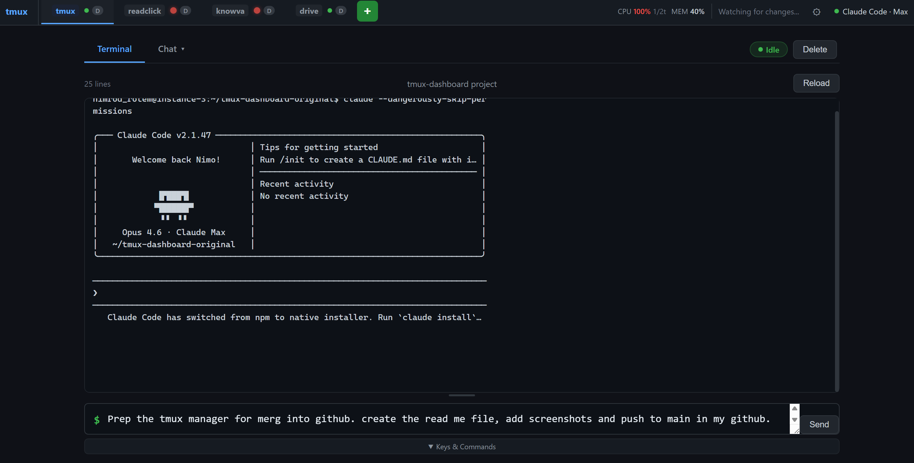

# Claude tmux Manager

A single-file FastAPI web app that turns every `tmux` session on your box into a fully manageable workspace in the browser — built specifically for orchestrating multiple concurrent **Claude Code** sessions.



## What it does

Claude Code runs beautifully inside a `tmux` session, but once you start juggling five or ten of them across different projects, the terminal stops scaling. This dashboard gives you:

- A **tabbed view of every session** with live terminal output and a parallel chat transcript
- **AI-generated titles, descriptions, and progress summaries** (OpenAI) so you know what each session is doing at a glance
- **Away Mode** — multi-phase autonomous prompt sequences that keep Claude working while you're AFK
- **Go Nuts Mode** — an autonomous feature-building loop that plans, implements, tests, and commits in a tight cycle
- **System stats**, per-session cost, token usage, idle detection, context-window warnings, and activity sparklines
- **Keyboard-first navigation** — rename, snooze, duplicate, reorder, mark-done, send-to-all, interrupt, cycle sessions, and more
- **File upload**, **CLAUDE.md viewer/editor** (home-dir-scoped, path-traversal protected), **sticky notes**, **message bookmarks**, **quick-reply templates**, toast notifications, and sound alerts
- **Hardened auth** — HMAC session cookie, rate-limited login, CSP/HSTS/Permissions-Policy headers, session-name validation before any shell call

It's a single Python file with no database — everything persists as JSON under `~/.tmux-dashboard/`.

## Prerequisites

- Python 3.9+
- `tmux` installed and on `PATH`
- OpenAI API key (optional — required for LLM summaries)
- Nginx or another reverse proxy (recommended for HTTPS)

## Quick Start

```bash
# Install dependencies
pip install -r requirements.txt

# Run the server
TMUX_DASH_USER=admin TMUX_DASH_PASS=yourpassword python3 app.py
```

The dashboard is then available at `http://localhost:8501/`.

## Environment Variables

| Variable | Required | Default | Description |
|----------|----------|---------|-------------|
| `TMUX_DASH_USER` | No | `admin` | Login username |
| `TMUX_DASH_PASS` | **Yes (in production)** | *(empty)* | Login password. **If unset, auth is disabled — all endpoints are publicly accessible.** |
| `TMUX_DASH_SECRET` | No | *(random on start)* | HMAC secret for session tokens. Set a stable value to survive restarts. |
| `OPENAI_API_KEY` | No | *(none)* | OpenAI key for LLM-generated titles, descriptions, and summaries. Without it, LLM features are disabled. |
| `TMUX_DASH_ROOT` | No | `/tmux` | URL root path when served behind a reverse proxy sub-path. |
| `PORT` | No | `8501` | TCP port to listen on. |

> **Security note**: Always set `TMUX_DASH_PASS` in production. Without it, the auto-respond and send-command endpoints can execute arbitrary keystrokes in any tmux session.

## Data Storage

All persistent data is stored in `~/.tmux-dashboard/` (permissions: `700`):

| File | Description |
|------|-------------|
| `messages.json` | Per-session chat message history |
| `notes.json` | AI-extracted session notes |
| `autonomous-modes.json` | Persisted Away Mode / Go Nuts Mode state |
| `anthropic_api_key` | Encrypted-at-rest API key (chmod 600) |

## Running via Supervisor

Example `/etc/supervisor/conf.d/tmux-dashboard.conf`:

```ini
[program:tmux-dashboard]
command=python3 /home/youruser/tmux-dashboard/app.py
directory=/home/youruser/tmux-dashboard
user=youruser
environment=TMUX_DASH_PASS="%(ENV_TMUX_DASH_PASS)s",TMUX_DASH_SECRET="%(ENV_TMUX_DASH_SECRET)s"
autostart=true
autorestart=true
stdout_logfile=/var/log/tmux-dashboard.log
stderr_logfile=/var/log/tmux-dashboard.log
```

## Nginx Configuration

```nginx
location /tmux/ {
    proxy_pass http://127.0.0.1:8501;
    proxy_set_header X-Forwarded-Proto $scheme;
    proxy_set_header X-Real-IP $remote_addr;
    proxy_set_header Host $host;
}
```

The `X-Forwarded-Proto: https` header is required for the `Strict-Transport-Security` and `Secure` cookie flag to activate.

## Development

```bash
# Run tests
make test

# Lint
make lint

# Lint + auto-fix
make lint-fix

# All common commands
make help
```

## Backup & Recovery

All persistent session data lives in `~/.tmux-dashboard/`. Back it up regularly:

```bash
# Backup data directory
make backup-data

# Verify JSON files are not corrupted
make restore-check

# Backup app.py before risky changes
make backup
```

**Crash recovery**: The server restores active Away Mode and Go Nuts Mode sessions automatically on restart. No action needed — just restart the supervisor process.

**Corrupted state**: If `~/.tmux-dashboard/*.json` becomes corrupt (server crash during write), restore from a backup. You can also delete the corrupt file — the app recreates it on next write with empty state.

**Secret rotation**: If `TMUX_DASH_SECRET` changes, all existing auth cookies become invalid. Users will be redirected to the login page. This is intentional — rotate by restarting with a new secret.

## Upgrading openai SDK (v1 → v2)

> **Status**: Deferred. openai 2.x is a major version with breaking changes. Human review required before upgrading.

Current usage in `app.py` (all standard, minimal API surface):

- `openai.AsyncOpenAI(api_key=...)` — client init
- `client.chat.completions.create(model, messages, max_tokens, temperature)` — single call pattern
- `resp.choices[0].message.content` — response access
- `resp.usage.total_tokens` — token counting

**Migration steps** (when ready):

1. Install: `pip install openai==2.*`
2. Run tests: `make test` (expect failures if any API changed)
3. Check openai v2 migration guide for any response schema changes
4. Verify `resp.usage` attribute names (may be `completion_tokens` vs `total_tokens`)
5. Check error types — `openai.OpenAIError` subclasses may have changed
6. Re-run tests and fix any failures before deploying

## API Endpoints

| Method | Path | Description |
|--------|------|-------------|
| GET | `/api/sessions-fast` | Session list (cached, no LLM calls) — used by the UI |
| GET | `/api/status` | Per-session activity status only (lightweight) |
| GET | `/api/stats` | System stats (CPU, memory, disk, uptime) |
| GET | `/api/health` | Health check (tmux, OpenAI key, data directory accessibility) |
| POST | `/api/sessions/create` | Create a new tmux session |
| DELETE | `/api/sessions/{name}` | Kill a tmux session |
| POST | `/api/sessions/{name}/refresh` | Force LLM refresh for one session |
| POST | `/api/sessions/{name}/send` | Send a command to a session |
| POST | `/api/sessions/{name}/interrupt` | Send Escape key to a session |
| POST | `/api/sessions/{name}/send-keys` | Send raw tmux key sequences |
| POST | `/api/sessions/{name}/upload` | Upload a file to the session's CWD |
| GET/POST | `/api/sessions/{name}/claude-md` | View/edit CLAUDE.md files |
| GET | `/api/sessions/{name}/stats` | Token usage and cost stats |
| POST | `/api/auth/api-key` | Store/clear Anthropic API key |
| GET | `/api/auth/claude-status` | Claude Code OAuth status |
| POST | `/api/auth/logout` | Revoke Claude Code OAuth session |
| GET | `/api/auth/usage` | Today's Claude Code token usage |
| GET/POST | `/api/sessions/{name}/away-mode` | Get/toggle Away Mode |
| GET/POST | `/api/sessions/{name}/go-nuts-mode` | Get/toggle Go Nuts Mode |

## License

MIT — see source header in `app.py` for attribution.
